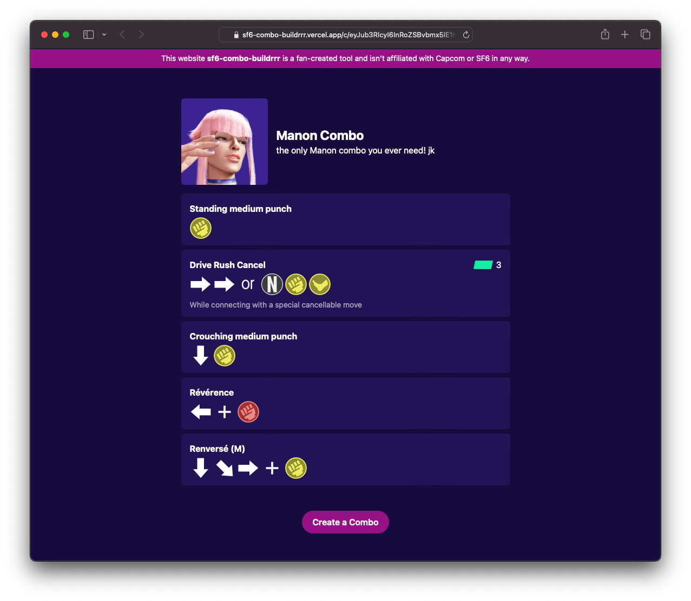
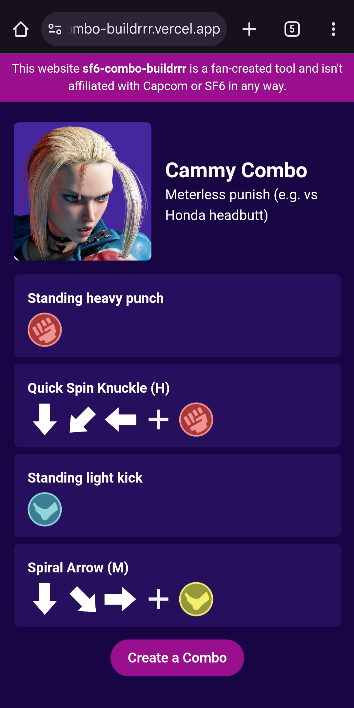

# 👊 combo buildrrr 🦶

For information about this project and to learn how to use it, visit the wiki: https://github.com/techygrrrl/sf6-combo-buildrrr/wiki



<p align="center">
  
</p>

---

## Development

The Vercel CLI has changed since the project was first created and now the project doesn't work without messing with the `vercel.json` file.

Remove the following from the `vercel.json` file so you can work locally:

```json
    {
      "src": "package.json",
      "use": "@vercel/static-build",
      "config": {
        "distDir": "dist"
      }
    },
```

If you run `go mod tidy` make sure the Vercel-related dependencies don't get removed. These need to be present in the `go.sum` file for the Go runtime to work correctly for the functions.
